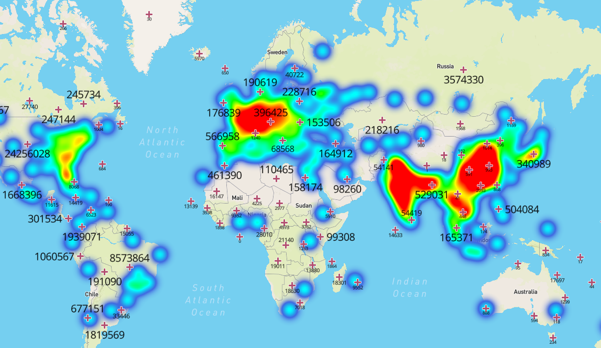

# Disease Spread
We are in the midst of a global pandemic. At the time this project started, the Corona virus was still just a headline for most - but in the meantime it reached and impacted all of our lives. Fighting such a pandemic happens in many ways on multiple scales. We are interested in how this can be done on the societal level: using data. We built a pipeline capable of processing a large dataset and created a visualization of the areas most vulnerable to Corona which includes reported cases in real-time.

[](https://dunnkers.com/disease-spread)

See [the visualization](https://dunnkers.com/disease-spread).

## General architecture - configuring GCP

GCP: Google Cloud Platform.

1. Create a GKE cluster
2. Connect to the *specific* cluster (don't just use the general Cloud console)
-> via UI or:
`gcloud container clusters get-credentials cluster-1 --zone europe-north1-a --project sixth-utility-268609`

3. Add Helm service account
https://medium.com/google-cloud/helm-on-gke-cluster-quick-hands-on-guide-ecffad94b0
-> using some `.yaml` config file.
4. Init helm
`helm init`

5. Verify there is a tiller pod
`kubectl get deploy,svc tiller-deploy -n kube-system`

(if, for some reason, you are getting the 'could not find tiller' error: https://github.com/helm/helm/issues/4685#issuecomment-433209134)

(if, you are getting a 'namespace default forbidden' error: https://github.com/fnproject/fn-helm/issues/21#issue-312627792)

... wait a bit untill tiller pods are ready.

## Installing a Kafka cluster
6. Install Kafka using a chart
https://github.com/helm/charts/tree/master/incubator/kafka

e.g.:
```shell
helm repo add incubator http://storage.googleapis.com/kubernetes-charts-incubator
helm install --name my-kafka incubator/kafka
```

Bitnami chart upgrading replicas amount:
`helm upgrade my-kafka bitnami/kafka --set replicaCount=3,defaultReplicationFactor=3,offsetsTopicReplicationFactor=3,transactionStateLogReplicationFactor=3,transactionStateLogMinIsr=3`

## Installing Kafdrop
7. Installing Kafdrop

e.g. using default settings:
```shell
git clone https://github.com/obsidiandynamics/kafdrop && cd kafdrop
helm upgrade -i kafdrop chart
```

Then, configure the broker address as `my-kafka:9092`:

```yaml
apiVersion: apps/v1
# [...]
spec:
  template:
    spec:
      containers:
      - env:
        - name: KAFKA_BROKERCONNECT
          value: my-kafka:9092
```

(can easily be done in the GCP UI)


Finally, optionally expose Kafdrop externally using a `LoadBalancer`:

```shell
kubectl expose deployment kafdrop --type=LoadBalancer --name=kafdrop-external-service
```

This will create an external IP address such that you can access Kafdrop from your browser. ✌🏼 (in production though, you will probably not want to do this.)

Or, use a config as such:
```yaml
apiVersion: v1
kind: Service
metadata:
  labels:
    app.kubernetes.io/instance: kafdrop
    app.kubernetes.io/managed-by: Tiller
    app.kubernetes.io/name: kafdrop
    helm.sh/chart: kafdrop-0.1.0
  name: kafdrop-external-service
spec:
  externalTrafficPolicy: Cluster
  ports:
  - nodePort: 31276
    port: 9000
    protocol: TCP
    targetPort: 9000
  selector:
    app.kubernetes.io/instance: kafdrop
    app.kubernetes.io/name: kafdrop
  sessionAffinity: None
  type: LoadBalancer
```
<!-- 
1. We use **Helm** to obtain 'charts' (packages) for Kubernetes:
https://docs.bitnami.com/google/get-started-gke/#step-4-install-and-configure-helm
    Login to Cloud Shell and run:
    ```shell
    curl https://raw.githubusercontent.com/kubernetes/helm/master/scripts/get-helm-3 > get_helm.sh
    chmod 700 get_helm.sh
    ./get_helm.sh
    ```
2. Install spark chart:
    ```shell
    helm repo add bitnami https://charts.bitnami.com/bitnami
    helm install my-release bitnami/spark
    ``` -->

## Install spark

1. Installing a Spark cluster
https://hub.helm.sh/charts/microsoft/spark

```shell
helm repo add microsoft https://microsoft.github.io/charts/repo
helm install --name my-spark microsoft/spark --version 1.0.0
```

2. (optionally) specify more suitable values for desired cpu and memory:

```shell
helm install --name my-spark microsoft/spark --version 1.0.0 --set Worker.Memory=2048Mi,Worker.DaemonMemory=1g,Worker.ExecutorMemory=1g,Livy.Enabled=false
```

(default is `2g` for `Worker.Memory`, which is probably too high for your GKE cluster.)


_(or, using Bitnami chart:)_
```shell
helm repo add bitnami https://charts.bitnami.com/bitnami
helm install --name my-spark bitnami/spark --set service.type=LoadBalancer
```

Testing whether your master accepts jobs:

```shell
./bin/spark-submit --master spark://my-spark-master:7077 --deploy-mode cluster --name spark-pi --class org.apache.spark.examples.SparkPi --conf spark.kubernetes.container.image=spark:v2.4.3 /opt/spark/examples/jars/spark-examples_2.11-2.4.3.jar
```

## Installing mongodb

Bitnami mongodb chart:

https://github.com/bitnami/charts/tree/master/bitnami/mongodb

1. ```shell
helm repo add bitnami https://charts.bitnami.com/bitnami
helm install --name my-mongodb bitnami/mongodb --set replicaSet.enabled=true,mongodbRootPassword=scalable123,mongodbUsername=admin,mongodbDatabase=geotest-db,mongodbPassword=scalable123
```
<!-- To  install the mongodb helm chart with a repo stable that looks at https://kubernetes-charts.storage.googleapis.com/: 
```shell
helm install my-mongodb stable/mongodb-7.8.7
``` -->

This will create a mongodb node witha an associated service ánd generates a secret called `mongodb-root-password` for authentication. To use it in a container that is supposed to connect to mongodb add the following to the container environment variables section in the deployment yaml:
```yaml
...
env:
  - name: MONGODB_ROOT_PASSWORD
    valueFrom:
      secretKeyRef:
        key: mongodb-root-password
        name: my-mongodb
...
```

Then the password can be used like in the following python snippet:
```python
password = os.getenv('MONGODB_ROOT_PASSWORD')
client = pymongo.MongoClient('mongodb://root:{}@my-mongodb:27017'.format(password))
```

## Upgrading Kubernetes cluster machine types

(from: https://cloud.google.com/kubernetes-engine/docs/tutorials/migrating-node-pool)

First, obtain the name of the node pool you want to upgrade:
```shell
gcloud container node-pools list
```

Then, upgrade the machine types:
```shell
gcloud container node-pools create larger-pool --cluster=cluster-1 --machine-type=n1-standard-1 --num-nodes=3
```

Now, make the previous pool nodes "unschedulable". Retrieve pool node names:

```shell
kubectl get nodes -l cloud.google.com/gke-nodepool=default-pool
```

Then for every node:

```shell
kubectl cordon <NODE>
```

After all nodes have been 'cordoned', 'drain' every node:

```shell
kubectl drain --force --ignore-daemonsets --delete-local-data --grace-period=10 <NODE>
```

Finally, we delete the old node pool:

```shell
gcloud container node-pools delete default-pool --cluster cluster-1
```

We can verify there exist only one node pool now using:

```shell
gcloud container node-pools list --cluster cluster-1
```

## Installing mongo-express

https://hub.helm.sh/charts/cowboysysop/mongo-express

1. `helm repo add cowboysysop https://cowboysysop.github.io/charts/`

2. `helm install --name my-mongo-express cowboysysop/mongo-express --version 1.1.0 --set mongodbServer=my-mongodb,mongodbEnableAdmin=true,mongodbAdminPassword=scalable123,basicAuthUsername=admin,basicAuthPassword=scalable123`

3. Expose external IP:

```yaml
---
apiVersion: v1
kind: Service
metadata:
  labels:
    app.kubernetes.io/name: mongo-express
  name: mongo-express-service
spec:
  ports:
  - port: 8081
    protocol: TCP
    targetPort: 8081
  selector:
    app.kubernetes.io/name: mongo-express
  sessionAffinity: None
  type: LoadBalancer
```

4. (optionally) upgrade chart to use a password:
`helm upgrade winning-ocelot cowboysysop/mongo-express --version 1.0.1 --set mongodbServer=my-mongodb,mongodbEnableAdmin=true,mongodbAdminPassword=jLWIWnJKe7,basicAuthUsername=admin,basicAuthPassword=scalable123`
-> or put the attributes basicAuth right from the start.

-> also available in `mongo-express-config` folder


### Special note

Copying files from pod to local filesystem.

`kubectl cp my-spark-zeppelin-77464b95b-7f7nb:datadump.json datadump.json`

## About
Project as part of the _Scalable Computing_ course (`WMCS16003`), taught at the University of Groningen (RUG) in the Data Science and Systems Complexity Master programme.

Built by [Jeroen Overschie](https://dunnkers.com), Joris de Jong and Pieter Dekker.